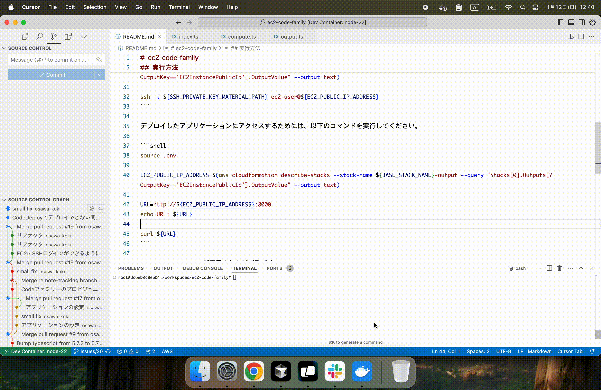

# ec2-code-family

🦃🦃🦃 Codeファミリーを用いてEC2にアプリケーションをデプロイしてみる！  

  

## 実行方法

`.env.example`をコピーして`.env`ファイルを作成します。  
中身を適切に設定してください。  
また、公開鍵ペアを作成してください。  
公開鍵を`SSH_PUBLIC_KEY_MATERIAL`に、秘密鍵を`SSH_PRIVATE_KEY_MATERIAL`に設定してください。  

DevContainerに入り、以下のコマンドを実行します。  
※ `~/.aws/credentials`にAWSの認証情報があることを前提とします。  

```shell
cdk bootstrap
cdk synth
cdk deploy --require-approval never --all
```

SSHでEC2に接続するためには、以下のコマンドを実行してください。  

```shell
ssh -i <秘密鍵のパス> ec2-user@<EC2のパブリックIPアドレス>

# ---

source .env

EC2_PUBLIC_IP_ADDRESS=$(aws cloudformation describe-stacks --stack-name ${BASE_STACK_NAME}-output --query "Stacks[0].Outputs[?OutputKey=='EC2InstancePublicIp'].OutputValue" --output text)

echo ${SSH_PRIVATE_KEY_MATERIAL} > ./ssh_private-key.tmp
chmod 400 ./ssh_private-key.tmp

ssh -i ./ssh_private-key.tmp ec2-user@${EC2_PUBLIC_IP_ADDRESS}
```

デプロイしたアプリケーションにアクセスするためには、以下のコマンドを実行してください。  

```shell
source .env

EC2_PUBLIC_IP_ADDRESS=$(aws cloudformation describe-stacks --stack-name ${BASE_STACK_NAME}-output --query "Stacks[0].Outputs[?OutputKey=='EC2InstancePublicIp'].OutputValue" --output text)

URL=http://${EC2_PUBLIC_IP_ADDRESS}:8000
echo URL: ${URL}

curl ${URL}
```

`{"Hello":"World"}`が表示されれば成功です。  

---

GitHub Actionsでデプロイするためには、以下のシークレットを設定してください。  

| シークレット名 | 説明 |
| --- | --- |
| AWS_ROLE_ARN | IAMロールARN (Ref: https://github.com/osawa-koki/oidc-integration-github-aws) |
| AWS_REGION | AWSリージョン |
| DOTENV | `.env`ファイルの内容 |

タグをプッシュすると、GitHub Actionsがデプロイを行います。  
手動でトリガーすることも可能です。  
